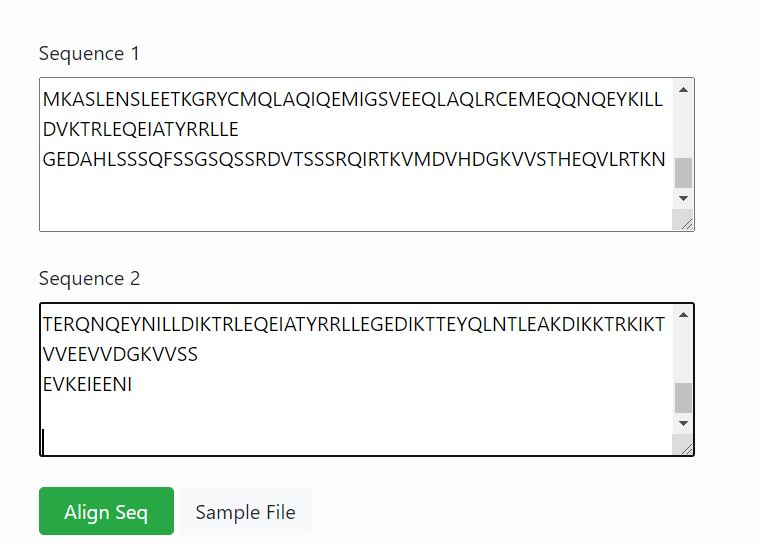
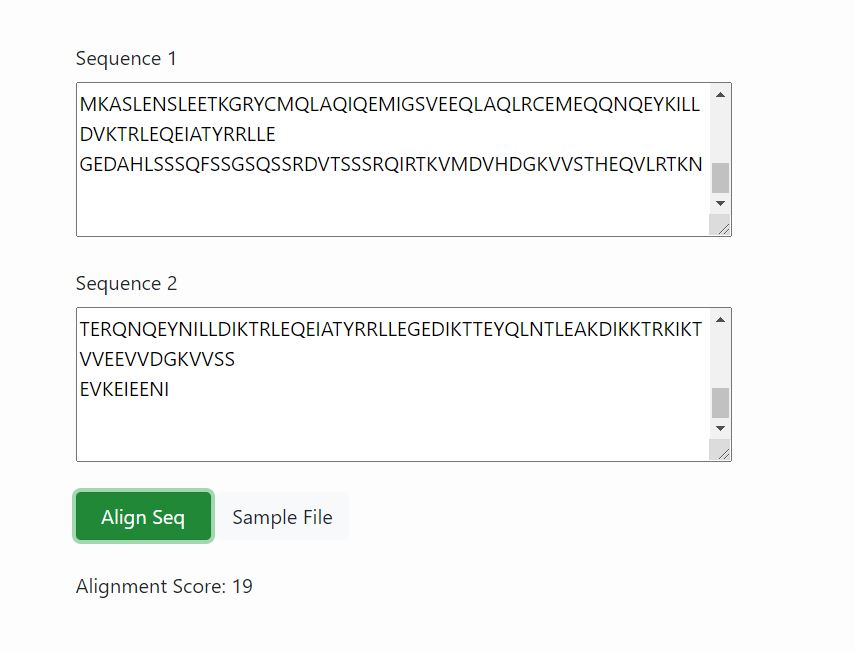

**Procedure to run the simulator**
&nbsp;
1.	User can enter the sequence to be compared in respective “ Sequence 1 and Sequence 2”  boxes. Retrieve sequence data in FASTA format from NCBI. 
&nbsp;
Consider examples,
&nbsp;
Sequence 1 -  Keratin[Homosapiens]
&nbsp;
>AAB59562.1 keratin [Homo sapiens]
MTTCSRQFTSSSSMKGSCGIGGGIGAGSSRISSVLAGGSCRAPNTYGGGLSVSSSRFSSGGAYGLGGGYG
GGFSSSSSSFGSGFGGGYGGGLGAGLGGGFGGGFAGGDGLLVGSEKVTMQNLNDRLASYLDKVRALEEAN
ADLEVKIRDWYQRQRPAEIKDYSPYFKTIEDLRNKILTATVDNANVLLQIDNARLAADDFRTKYETELNL
RMSVEADINGLRRVLDELTLARADLEMQIESLKEELAYLKKNHEEEMNALRGQVGGDVNVEMDAAPGVDL
SRILNEMRDQYEKMAEKNRKDAEEWFFTKTEELNREVATNSELVQSGKSEISELRRTMQNLEIELQSQLS
MKASLENSLEETKGRYCMQLAQIQEMIGSVEEQLAQLRCEMEQQNQEYKILLDVKTRLEQEIATYRRLLE
GEDAHLSSSQFSSGSQSSRDVTSSSRQIRTKVMDVHDGKVVSTHEQVLRTKN
&nbsp;

Sequence 2 - keratin [Rattus norvegicus]
&nbsp;
>AAA41473.1 keratin [Rattus norvegicus]
MDFSRRSFHRSLSSSSQGPALSTSGSLYRKGTMQRLGLHSVYGGWRHGTRISVSKTTMSYGNHLSNGGDL
FGGNEKLAMQNLNDRLASYLEKVRSLEQSNSKLEAQIKQWYETNAPSTIRDYSSYYAQIKELQDQIKDAQ
IENARCVLQIDNAKLAAEDFRLKFETERGMRITVEADLQGLSKVYDDLTLQKTDLEIQIEELNKDLALLK
KEHQEEVEVLRRQLGNNVNVEVDAAPGLNLGEIMNEMRQKYEILAQKNLQEAKEQFERQTQTLEKQVTVN
IEELRGTEVQVTELRRSYQTLEIELQSQLSMKESLERTLEETKARYASQLAAIQEMLSSLEAQLMQIRSD
TERQNQEYNILLDIKTRLEQEIATYRRLLEGEDIKTTEYQLNTLEAKDIKKTRKIKTVVEEVVDGKVVSS
EVKEIEENI
&nbsp;

&nbsp;

2.	Then click on Align Seq tab to run simulator.
&nbsp;

&nbsp;

3.	The alignment score for the given aminoacid sequence matrix is given as output which indicates the relative score obtained by matching two characters in a sequence alignment.
&nbsp;

4.	User can also download simple file given in the GUI and follow Steps 1 and 2 to get output. 
&nbsp;

**DIY**

1.	Follow ( https://vlab.amrita.edu/index.php?sub=3&brch=311&sim=1835&cnt=2) to install R in personal computer.

2.	Install the SeqinR package.

3.	To load “SeqinR” R package follow 
      
      library("seqinr") 
      
     Import “seqinr” library to R workspace
     
     Connect to the ACNUC database
     
     Query the sequences using accession number and assign to a variable
     
     Import “Biostrings” library to R workspace
     
     Load Blosum50 scoring matrix
     
     Convert the amino acid sequences into strings
     
     Convert the string into uppercase
     
     Pairwise align the sequences with gap values input
     
     Assign the alignment data into a matrix
